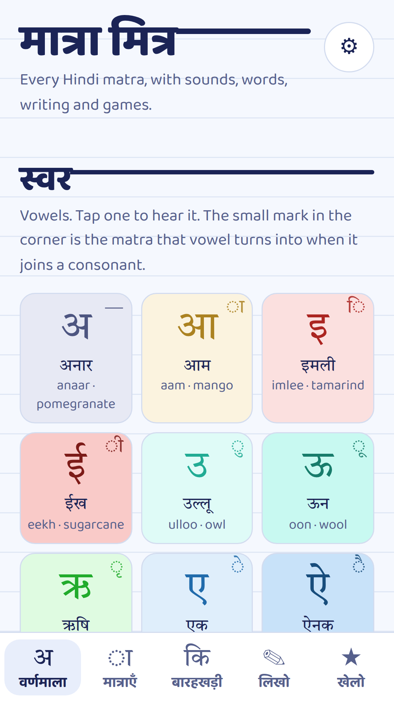
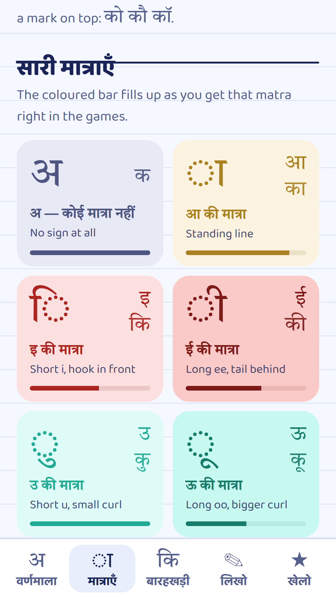
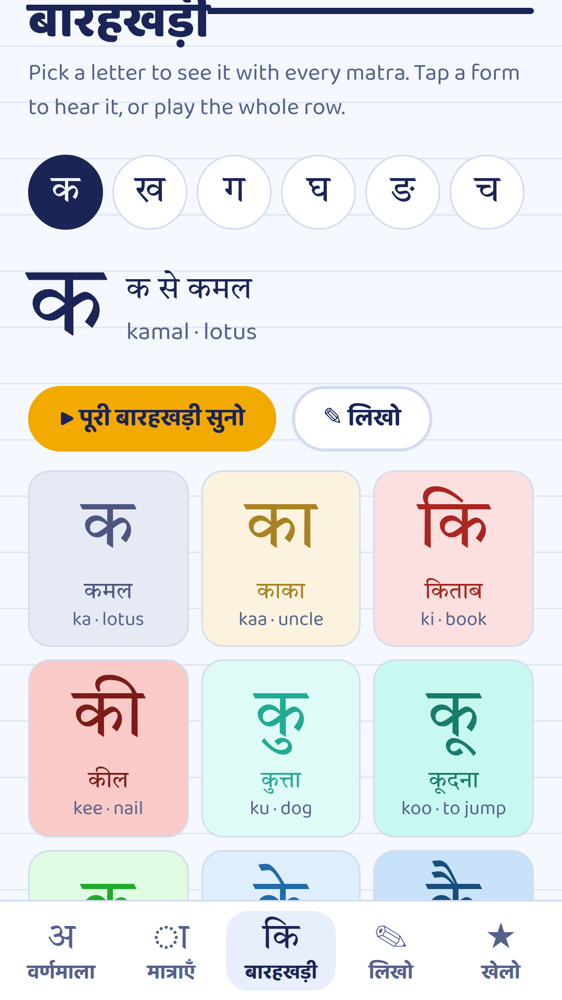
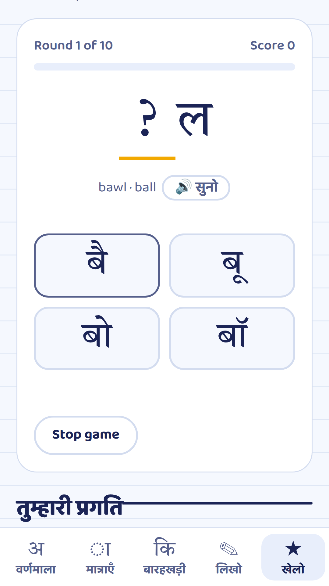
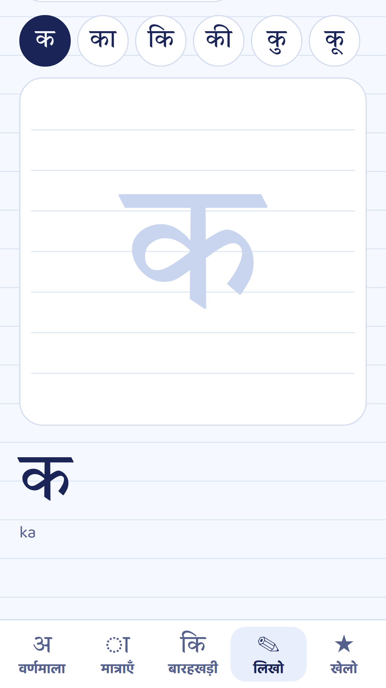

# मात्रा मित्र · Matra Mitra

**A friendly Hindi reading app for young children — learn every letter and every matra with sounds, words, tracing and games.**

<p align="center">
  
</p>

Matra Mitra helps a child go from recognising letters to reading simple Hindi words, one matra at a
time. Everything is spoken aloud, colour-coded and tappable, so a child can explore on their own
while a parent sits alongside.

- **Works fully offline** — the app, fonts and stories are all inside the APK.
- **No ads, no sign-in, no data collected.** See [PRIVACY.md](PRIVACY.md).
- **Runs on Android 7.0 and newer.** Letters are read aloud by the phone's own Hindi text-to-speech voice.

<p align="center">
  
  
  
  
  
</p>

---

## What's inside

The app has five tabs along the bottom.

### अ · वर्णमाला (Alphabet)
All vowels and consonants, grouped the way Hindi school textbooks group them — including क्ष, त्र,
ज्ञ, श्र, ड़ and ढ़. Tap any letter to hear it along with a word that starts with it.

Every consonant also has a **short story** with tappable, colour-coded words, so the child meets the
letter inside real sentences (with an English line for the grown-up).

### ◌ा · मात्राएँ (Matras)
Every matra — ा ि ी ु ू ृ े ै ो ौ ॉ ं ँ ः. See where each one sits on the letter, hear how it
changes the sound, and find simple words that use it.

A special **छोटी–बड़ी जोड़ियाँ (short–long twins)** section practises the pairs children mix up most:
कि/की, कु/कू, के/कै, को/कौ. Short sounds are shown in a light colour and long sounds in a dark one,
so the difference is visible as well as audible.

### कि · बारहखड़ी (Barakhadi)
Pick any letter and see it combined with every matra, each with an example word. Play the whole
row aloud — क, का, कि, की, कु, कू… — to practise the rhythm of the barakhadi.

### ✎ · लिखो (Write)
Trace letters with a finger on the screen and earn up to three stars for each one.

### ★ · खेलो (Play)
Three games that check what the child has learnt:
1. **Hear and pick** — listen to a sound and tap the right letter.
2. **Read it** — see a letter or word and choose what it says.
3. **Finish the word** — add the missing matra to complete a word.

A **progress** view shows which matras are strong and which need more practice, and can start a
round using only the weak ones.

### Settings
- **Voice** — test the Hindi voice, with a shortcut to the phone's voice settings if one is missing.
- **Speaking speed** — slow it down for beginners.
- **English sound hints** — show "ka, kaa, ki…" under letters; switch off once the child reads on their own.
- **Theme** — light or dark, or follow the phone.
- **Reset progress** — clear game scores on this device.

> **For the grown-up:** start with the letters in the child's name and favourite words, add one new
> matra every few days, and keep returning to whichever twin (कि/की, कु/कू…) trips them up. Ten
> focused minutes beats an hour of pressure.

---

## Download and install the APK

Until the app is on the Google Play Store, you can install it directly from this repository.

### Step 1 — Download the APK

Every change pushed to this repository automatically builds a fresh APK.

1. Sign in to GitHub (downloading build files needs a free GitHub account).
2. Open the **[Actions → Build APK](https://github.com/Vibhu1712/MatraMitra-Android/actions/workflows/build-apk.yml)** page.
3. Click the newest run at the top that has a **green tick ✅**.
4. Scroll down to **Artifacts** and click **`matra-mitra-apk`**. A `.zip` file downloads.
5. Unzip it. Inside is **`app-debug.apk`** — this is the app.

> If a **Releases** section appears on the right side of this repository's main page, you can
> instead open the latest release and tap the `.apk` file under **Assets** — no GitHub account or
> unzipping needed.

### Step 2 — Get the APK onto the phone

- If you downloaded on the phone itself, the APK is already in the **Downloads** folder.
- If you downloaded on a computer, send `app-debug.apk` to the phone by USB cable, Google Drive,
  email or WhatsApp (send it as a *document*, not as media).

### Step 3 — Install it

1. On the phone, open **Files** (or **Downloads**) and tap **`app-debug.apk`**.
2. Android will say installing from this source isn't allowed. Tap **Settings**, turn on
   **Allow from this source**, then go back.
3. Tap **Install**. If Google Play Protect shows a warning about an unknown app, tap
   **More details → Install anyway** — this appears for any app not yet on the Play Store.
4. Open **मात्रा मित्र** from the app drawer.

> **Updating:** download and install a newer APK the same way; it replaces the old one and keeps
> progress. If Android says the package conflicts with an existing one, uninstall the old app first.

### Step 4 — Turn on the Hindi voice (if letters are silent)

The app speaks using the phone's text-to-speech. If you hear nothing:

**Settings → Accessibility (or System → Languages) → Text-to-speech → Speech Services by Google →
Install voice data → Hindi (India).**

The app shows a shortcut to this screen whenever a Hindi voice is missing.

---

## For developers

The Android app is a small Java wrapper that shows the bundled Matra Mitra web page
(`app/src/main/assets/index.html`) in a WebView and connects it to the phone's text-to-speech engine.

- Package: `org.matramitra.app`
- Targets Android 16 (API 36), as Google Play requires for new apps from 31 Aug 2026; minimum Android 7.0 (API 24).
- Built with Gradle and Java 17. Build locally with `./gradlew assembleDebug`.

### Building a signed release for Google Play

**1. Create your upload key (once, keep it safe forever).** Google Play needs every upload signed with
the same private key. `keytool` comes with Java or Android Studio
(Windows: `C:\Program Files\Android\Android Studio\jbr\bin\keytool.exe`).

```
keytool -genkeypair -v -keystore upload.jks -keyalg RSA -keysize 2048 -validity 10000 -alias upload
```

Back up `upload.jks` and the password somewhere safe (not in this repository). If you lose it you can
ask Google to reset it, but it takes time. Then turn the key into text so GitHub can store it:

```
# Windows PowerShell
[Convert]::ToBase64String([IO.File]::ReadAllBytes("upload.jks")) | Set-Content upload.b64
# Linux/macOS
base64 -w0 upload.jks > upload.b64
```

**2. Give GitHub the key as secrets.** Repository → **Settings → Secrets and variables → Actions →
New repository secret**. Add four:

| Name | Value |
|---|---|
| `KEYSTORE_BASE64` | the whole content of `upload.b64` |
| `KEYSTORE_PASSWORD` | the keystore password |
| `KEY_ALIAS` | `upload` |
| `KEY_PASSWORD` | the key password (same as keystore password unless you set a different one) |

Then **Actions → Build APK → Run workflow**. The run also produces **matra-mitra-play-bundle**
(`app-release.aab`, the file you upload to Play) and **matra-mitra-signed-apk** (a signed APK for phones).

**3. Privacy policy page.** Play needs a public privacy policy link. Edit the email in
`docs/privacy-policy.html`, then turn on **Settings → Pages → Deploy from a branch → main → /docs**.
The link becomes `https://vibhu1712.github.io/MatraMitra-Android/privacy-policy.html`.

**4. Every update.** Raise `versionCode` (and `versionName`) in `app/build.gradle`, push, and upload
the new `.aab`. Play rejects a bundle whose versionCode was already used.

### Store listing material

`play-store/` has the 512×512 icon, the 1024×500 feature graphic, five phone screenshots and
ready-to-paste listing text.

---

## Font licences

Baloo 2 and Tiro Devanagari Hindi are used under the SIL Open Font License; the licence texts are
in `app/src/main/assets/fonts/`.
